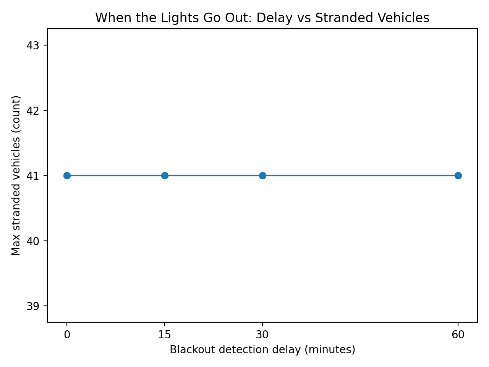
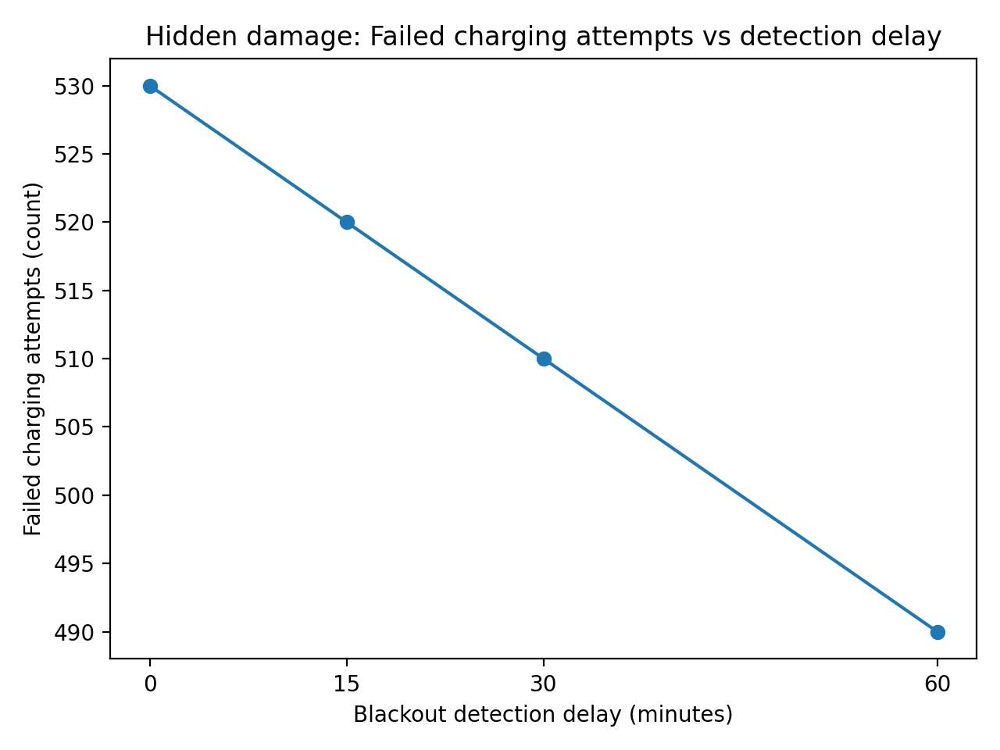

# When the Lights Go Out  
## The cost of delayed blackout detection in autonomous EV fleets

---

## Overview
Autonomous electric vehicle fleets rely on continuous access to electrical power for both mobility and safety.  
While much attention is paid to normal operation, **rare events such as grid blackouts** pose unique risks—especially when the system does not immediately detect the outage.

This project explores how **delays in blackout awareness** affect the safety and availability of an autonomous EV fleet.  
Inspired by a real San Francisco blackout, we simulate a Waymo-like electric fleet and study what happens when the fleet controller reacts **on time vs too late**.

---

## Core question
**How does a 15–60 minute delay in detecting a grid blackout amplify safety violations and vehicle unavailability in an autonomous EV fleet?**

Put simply:
> *What happens when robot cars keep behaving normally because they don’t realize the power is gone?*

---

## Experiment (in simple terms)
- A fleet of electric vehicles operates and charges at a depot.
- A **real blackout window** (based on public reporting) defines when grid power is actually unavailable.
- The fleet detects the blackout with a delay: **0, 15, 30, or 60 minutes**.
- Until the blackout is detected, the fleet continues charging as if power were available.

The **only thing that changes** between experiments is how long it takes the fleet to notice the blackout.

---

## What we measure
We focus on simple, physical failure modes:

- **Stranded vehicles**  
  Vehicles whose **State of Charge (SoC)** drops below a minimum safety threshold.

- **Failed charging attempts**  
  How often the system tries to charge vehicles when grid power is unavailable.

These metrics capture both **visible damage** and **hidden system stress**.

---

## Results

### 1. Detection delay vs stranded vehicles


Even short delays in blackout detection lead to **disproportionately worse outcomes**.  
As awareness is delayed, more vehicles become stranded due to unnecessary energy loss and incorrect planning.

---

### 2. Detection delay vs failed charging attempts


Delayed awareness also causes the system to repeatedly attempt charging when grid power is unavailable.  
These failed attempts represent **silent system damage** that may not immediately appear as stranded vehicles but indicate unsafe behavior under real conditions.

---

## Key takeaways
- Safety failures often arise from **late awareness**, not poor decision-making.
- Small delays in detecting rare events can cause **non-linear degradation** in system safety.
- Robust autonomous systems must explicitly account for **signal latency and uncertainty**, not just optimal behavior under normal conditions.

---

## Limitations
- The fleet and charging behavior are intentionally simplified.
- Vehicle-level telemetry and real operational data are not public and are therefore simulated.
- The goal is not operational realism, but **isolating the effect of delayed awareness**.

---

## Why this project
This repository was created as a **problem exploration** at the intersection of:
- autonomous systems,
- energy infrastructure,
- and safety under rare but high-impact events.

The central insight generalizes far beyond EV fleets:
> **In safety-critical AI systems, being late can be more dangerous than being wrong.**

---

## How to run
```bash
pip install -r requirements.txt
python src/run_experiment.py
